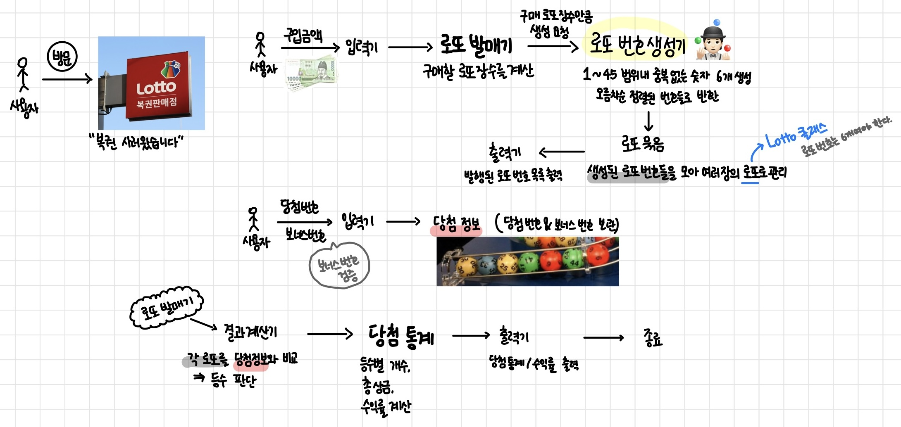

# 로또 발매기 💵

구입한 로또 번호를 당첨번호와 보너스 번호를 비교한 후 당첨 결과를 알려준다.

---

## 기능 명세서



### 1. 로또 구입 금액을 입력 받는다.

- 사용자가 구입 금액을 입력하면, 입력값을 검증한다.
- 1,000원 단위로 나누어떨어지는 금액만 유효하다.
- 입력받은 금액을 통해 구매할 로또 개수를 계산한다.
- [예외상황]
    - 1,000원으로 나누어 떨어지지 않는 경우 ➔ `[ERROR] 구입 금액은 1,000원 단위여야 합니다.`
    - 숫자 형식이 아닌 경우 (문자,공백 등)
    - 음수 입력한 경우
    - `null`, 빈 문자열 입력한 경우

### 2. 발행한 로또 수량 및 번호를 출력한다. (로또 번호는 오름차순으로 정렬)

- 구입 금액에 해당하는 개수만큼 로또를 발행한다. (한 장당 6개의 번호)
- 각 로또 번호는 1~45 범위 내의 **중복되지 않은 6개의 숫자**를 랜덤으로 생성한다.
- 번호는 오름차순으로 정렬하여 출력한다.
- 총 발행된 로또 수량과 각 로또 번호 목록을 출력한다.

### 3. 당첨 번호를 입력 받는다.

- 쉼표(,)로 구분된 6개의 번호를 입력받는다.
- 모든 번호는 1~45 범위 내에 있고, 중복되지 않아야 한다.
- [예외상황]
    - 쉼표 기준이 아닌 잘못된 구분자 사용한 경우
    - 6개의 숫자가 아닌 경우 (5개, 7개 등)
    - 중복된 숫자 포함된 경우
    - 숫자가 아닌 값이 포함된 경우
    - 음수 입력한 경우
    - 1~45 범위를 벗어난 숫자가 작성된 경우

### 4. 보너스 번호를 입력 받는다.

- 1~45 범위 내에서 한 개의 숫자를 입력받는다.
- 당첨 번호와 중복되지 않아야 한다.
- [예외상황]
    - 숫자 형식이 아닌 경우
    - 음수 입력한 경우
    - 2개 이상 입력한 경우
    - 1~45 범위를 벗어난 숫자가 작성된 경우
    - 당첨 번호와 중복된 경우

### 5. 당첨 결과를 계산한다.

- 구매한 모든 로또 번호를 당첨 번호와 비교한다.
- 일치 개수 및 보너스 번호 일치 여부에 따라 등수를 계산한다.
- 각 등수별 당첨 횟수를 계산한다.

```markdown
- 당첨 기준 및 상금
    - 1등: 6개 번호 일치 / 2,000,000,000원
    - 2등: 5개 번호 + 보너스 번호 일치 / 30,000,000원
    - 3등: 5개 번호 일치 / 1,500,000원
    - 4등: 4개 번호 일치 / 50,000원
    - 5등: 3개 번호 일치 / 5,000원
```

- 총 당첨 금액과 수익률을 계산한다.
    - 수익률 : (총 당첨 금액/총 구입 금액) * 100
    - 수익률은 소수점 둘째 자리에서 반올림하고, % 기호와 함께 출력한다.
    - ex. 100.0%, 51.5%, 1,000,000.0%

### 6. 당첨 내역을 출력한다.

- 각 등수별 일치 개수와 상금, 당첨 횟수를 출력한다.

```markdown
당첨 통계
---
3개 일치 (5,000원) - 1개
4개 일치 (50,000원) - 0개
5개 일치 (1,500,000원) - 0개
5개 일치, 보너스 볼 일치 (30,000,000원) - 0개
6개 일치 (2,000,000,000원) - 0개
총 수익률은 62.5%입니다.
```

- 출력 후 로또 게임을 종료한다.

---

## 🚨 예외 처리 정책 🚨

- 잘못된 값을 입력할 경우 `IllegalArgumentException`을 발생
- "[ERROR]"로 시작하는 에러 메시지를 출력
- 그 부분부터 입력을 다시 받는다.
